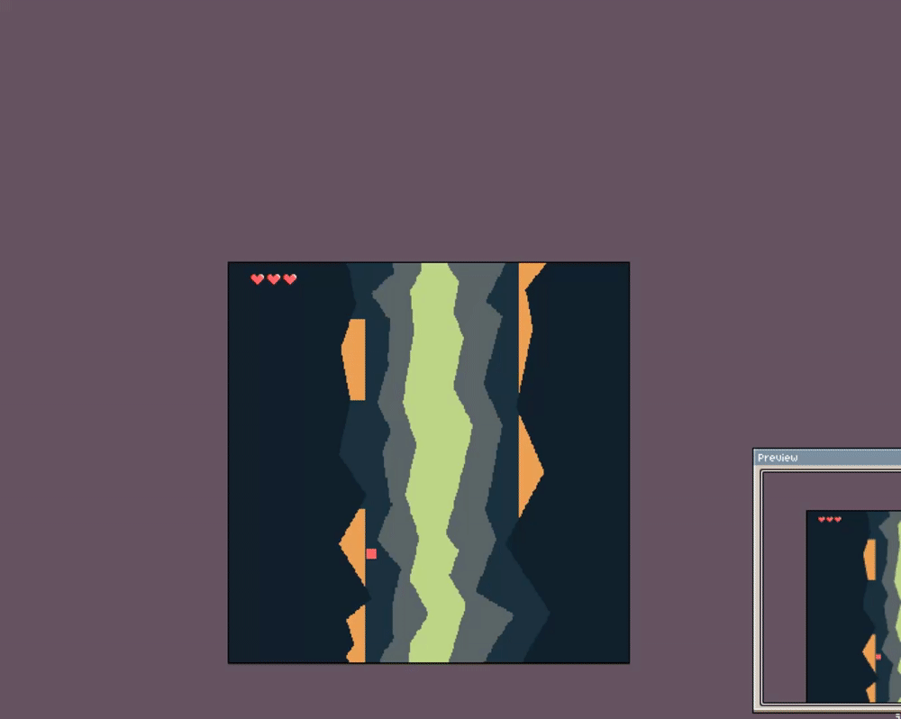

#DevLog
THUS FAR: ~12:00h.
## Upwards

 

  
Dev Gifs!!

  []

  []
  

 
 
 

## Building:
Only on Windows.
- go to root folder
- use command "make"
- either run Game.exe from build folder or use "run.bat" file

## Game 2/10 in the 10 games in 10 weeks challenge
////////////////////////////////////
              NOTE:
////////////////////////////////////
#### Goals:
- spend min ~12h per game
- aim for 10 games by week 10 
- have a small scope finished game by the end of the week
- even if not finished - still release it

////////////////////////////////////
              TODO:
////////////////////////////////////
- player lives
- sound

////////////////////////////////////
              DONE:
////////////////////////////////////
// 11.10.23 - ~2:00h
- game reset
- traps spawning
- traps wrapping

// 10.10.23 - ~0:45h
- added game screen states
- basic collision detection with player
- basic death of player
- basic transition from game states

// 09.10.23 - ~1h
- player jumping from platform to platform

// 08.10.23 - ~1:30h
- platform spawning
- platform movement

// 04.10.23 - ~2h
- static mockup implemented
- environment layering 
- environment movement and wrapping

// 03.10.23 - ~2:45h
- played around with FPS timing and caps
- static mockup implementation tests
- project structure testing

// 02.10.23 - ~2:45h
- WIP: basic project skeleton - need to think a bit about how to best structure
- WIP: mockup - mostly ready
- add: spritesheet cut from the mockup, ready to start implementing
